# Assinaturas Digitais

> *O que é uma assinatura digital?*

Uma **assinatura digital** é usada para demonstrar que você conhece a **chave privada** que conectada a uma **chave pública**, **sem precisar revelar a chave privada**.

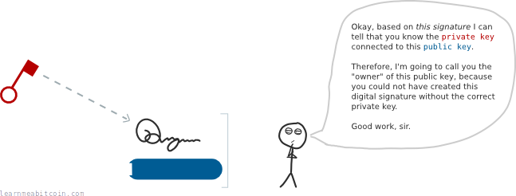

Se qualquer pessoa perguntar se você tem a **chave privada** para uma **chave pública** específica (ou [endereço](https://learnmeabitcoin.com/technical/keys/address/)), você pode fornecê-la com uma assinatura digital para provar que possui.

 

### Por que nós usamos assinaturas digitais no Bitcoin?

Quando você faz uma [transação](https://learnmeabitcoin.com/beginners/guide/transactions/), você precisa desbloquear as [saídas](https://learnmeabitcoin.com/beginners/guide/outputs/) que quer gastar.

Para isso, você precisa demonstrar que você “possui” a saída. Isso é feito provando que você sabe a **chave privada** do endereço para qual a saída está bloqueada.

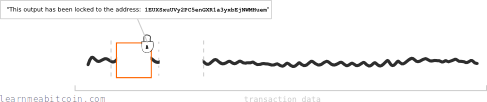

 
Mas se você colocar sua chave privada diretamente na transação, qualquer pessoa na rede será capaz de vê-la.

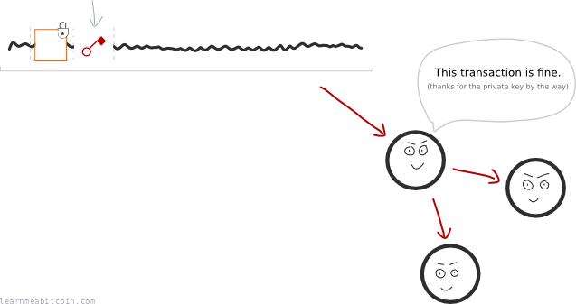

E se alguém pegar sua chave privada, essa pessoa poderá usá-la para desbloquear e gastar qualquer saída que esteja bloqueada para o mesmo endereço.

Então, como podemos desbloquear saídas sem fornecer nossa **chave privada**?

 

### Utilize uma assinatura digital

Uma **assinatura digital** pode ser criada a partir de uma **chave privada** para provar que você conhece a chave privada de um endereço.

Isso significa que podemos usar uma assinatura digital para desbloquear saídas sem precisar revelar nossa **chave privada**:

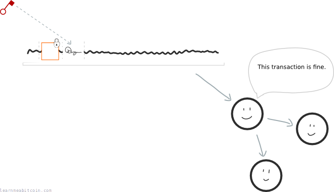

Esta é a razão de usarmos assinaturas digitais em vez colocar nova **chave privada** diretamente nos dados da transação.

 

### O que impede alguém de reutilizar uma assinatura digital?

Ótima pergunta. Afinal, se a **chave privada** desbloqueará qualquer saída bloqueada para um endereço, por que alguém não consegue pegar uma assinatura digital e utilizá-la para fazer a mesma coisa?

**Resposta**: Porque todas as assinaturas digitais estão ligadas a uma transação.

Em outras palavras; você não usa **chave privada** para criar uma assinatura digital, você sua a **chave privada** *e* os dados originais da transação.

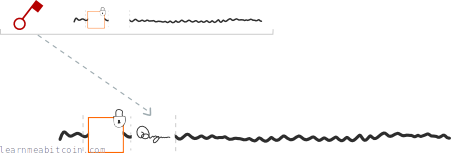

Portanto, cada assinatura digital está ligada à transação na qual está sendo utilizada.

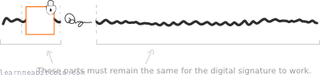

Então, se alguém tentar utilizar essa assinatura digital em uma transação diferente, essa assinatura não irá corresponder aos dados da transação em que foi criada originalmente, e os nós na rede Bitcoin irão rejeitá-la.

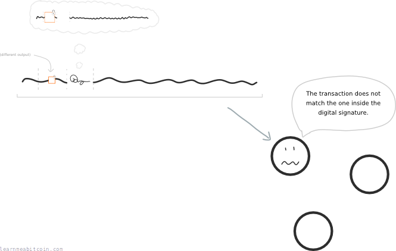

Além disso, a assinatura digital também protege contra qualquer alteração nos dados da transação. Porque, se os dados da transação forem alterados (por exemplo, se alguém tentar mudar o valor enviado ou o destinatário), a assinatura digital não funcionará mais.

 

### Como funcionam as assinaturas digitais?

Matemática, a boa e velha matemática.

A utilização de assinaturas digitais tem duas etapas:

1. **Assinar**: Você combina a **chave privada + os dados da transação**, e usa a matemática para criar uma assinatura digital.
2. **Verificar**: Agora você pode pegar a *assinatura digital + os dados da transação + chave pública*, e aplicar mais um pouco de matemática, e o resultado irá confirmar se a **chave privada** utlizada para assinar é legítima.

Lembre-se, o objetivo de utilizar uma **assinatura digital** é provar que você é o proprietário de uma **chave pública.**

> **Dica:** Não esqueça que um endereço é apenas uma **codificação de uma chave pública** (apresentada de outra forma).

Eu sei que no início parece mágica, mas é apenas matemática.

 

### Como criar uma assinatura digital?

Uma assinatura digital contém duas partes:

1. Uma parte **aleatória.**
2. Uma parte de **assinatura.**

### 1. Parte Aleatória

Comece gerando um enorme número aleatório.

Em seguida, multiplique esse número pelo ponto gererador na curva elíptica (o mesmo gerador utilizado para gerar uma **chave pública**).

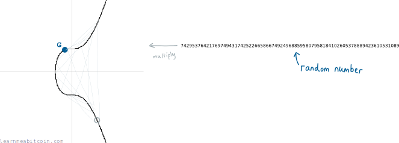

A parte **aleatória** da sua **assinatura digital** é o ponto na curva que obtemos. Mas nós apenas pegaremos a **coordenada x**.

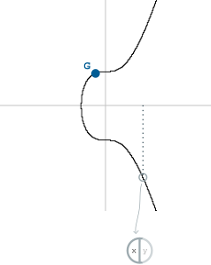

Chamaremos isso de “r” para simplificar.

> **Nota:**
- Esse é basicamente o mesmo processo de criar uma **chave privada** e uma **chave pública.** Porém aqui nós estamos fazendo isso para adicionar um elemento aleatório dentro da nossa assinatura digital.
- Esse elemento único ajuda a garantir que cada assinatura digital é única.

Com isso, nós já temos a *primeira metade* da nossa *assinatura digital* pronta, mas ainda não utilizamos nossa **chave privada**.  Aqui é onde a segunda metade começa…

### 2. Parte da Assinatura

Agora, nós pegamos a **chave privada,** e múltiplicamos por **r** (a coordenada x daquele ponto aleatório na curva que acabamos de descobrir).

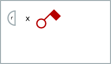

Depois nós adicionamos a coisa que queremos assinar. Isso é chamado de mensagem. No Bitcoin, a mensagem é o hash de todos os dados da transação que contém a saída que queremos desbloquear:

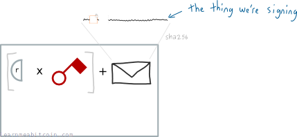

**Dica:** Incluir o hash da transação vincula a assinatura a uma transação (Então a assinatura não pode ser utilizada em uma transação diferente).

Por último, para garantir, nós dividimos tudo isso pelo número aleatório que usamos inicialmente:

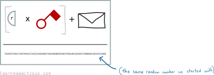

E pronto, temos a parte da “assinatura” da nossa assinatura digital. Chamaremos isso de “**s**”.

Essa assinatura é inserida agora na seção [código de desbloqueio](https://learnmeabitcoin.com/technical/transaction/input/scriptsig/) de uma transação.

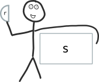

Agora começa a parte divertida…

Se alguém pedir que provemos que sabemos a **chave privada** de uma **chave pública,** podemos fornecer a nossa **assinatura digital** (**r** e **s**) como prova.

Mas como alguém pode usar isso como uma prova?

 

### Como verificar uma assinatura digital?

Para verificar que uma *assinatura digital* foi feita usando a chave privada correta, a pessoa a quem você dá sua assinatura digital precisa usar ambas as partes para encontrar **dois novos pontos** em uma curva elíptica:

### Ponto 1

Divida a *mensagem* por **s.** O primeiro ponto é o *ponto gerador* multiplicado por esse valor.

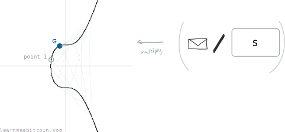

### Ponto 2

Divida **r** por **s.** O segundo ponto é igual a chave pública multiplicada por esse valor:

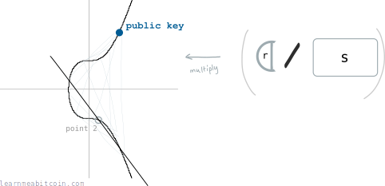

 

### Verificação

Agora nós adicionamos esses dois pontos juntos, e teremos um terceiro ponto na curva:

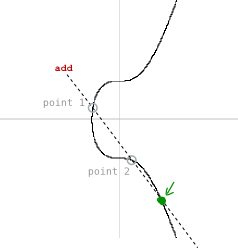

Se a coordenada x desse terceiro ponto for a mesma coordenada x do ponto aleatório com o qual começamos (**r**), então esta é a prova que a assinatura digital foi criada pela **chave privada** conectada à **chave pública.**

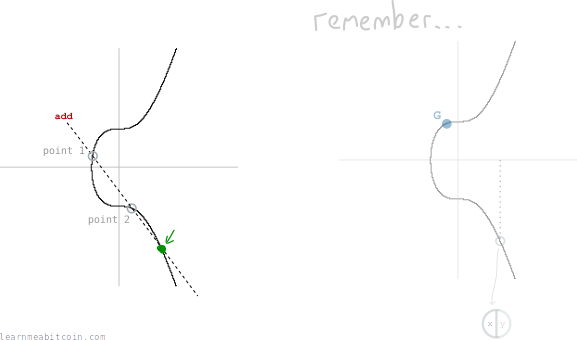

> **Nota: Esta é uma explicação simplificada da matemática envolvida nas assinaturas digitais.** Para uma explicação mais técnica, consulte [ECDSA](https://learnmeabitcoin.com/technical/cryptography/elliptic-curve/ecdsa/).

 

Referências:

- [Bitcoin 101: The Magic of Signing & Verifying](https://www.youtube.com/watch?v=U2bw_N6kQL8) – Um excelente vídeo introdutório que aborda a verdadeira matemática envolvida na geração e verificação de assinaturas digitais.
