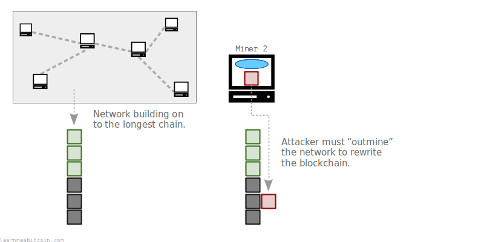

# Como o Bitcoin funciona?

Referência: https://learnmeabitcoin.com/beginners/how-does-bitcoin-work/

Bitcoin é um **sistema de pagamento eletrônico** que permite a qualquer pessoa criar uma conta e enviar qualquer quantia de dinheiro para qualquer pessoa no mundo.

Talvez você queira ler isso novamente.

O Bitcoin foi criado como uma alternativa ao sistema financeiro atual. No sistema atual, há um pequeno número de grandes bancos que controlam quem pode criar uma conta e quais transações podem ser feitas. Isso centraliza o controle do dinheiro, e não temos outra opção além de confiar que esses bancos agirão de forma justa e responsável.

> Temos que confiar nos bancos para guardar nosso dinheiro e transferi-lo eletronicamente, mas eles o emprestam em ondas de bolhas de crédito, mantendo apenas uma pequena fração em reserva.

- *Satoshi Nakamoto, [p2pfoundation.ning.com](http://p2pfoundation.ning.com/forum/topics/bitcoin-open-source)*

O Bitcoin foi desenvolvido em resposta à crise financeira de 2007-2008 causada pela centralização do sistema atual. Foi projetado por Satoshi Nakamoto, e lançado em janeiro de 2009 como um sistema de pagamento que opera *sem* um ponto central de controle.

O Bitcoin é um [software de código aberto](https://github.com/bitcoin/bitcoin/), o que significa que qualquer pessoa pode executar o programa e interagir com o sistema. 

A seguir, uma explicação simples sobre como isso funciona.

### Conteúdo

- [O que é o Bitcoin?](#o-que-é-o-bitcoin)
- Qual problema o Bitcoin resolve?
- Como a mineração funciona?
    - De onde vem os bitcoins?
- Por que chamamos o arquivo de “blockchain”?
- Como as transações funcionam?
- Como você possui bitcoins?
- Resumo
- Conclusão

### O que é o Bitcoin?

O Bitcoin é apenas um programa de computador. Você pode [baixá-lo](https://bitcoin.org/en/download) e executá-lo no seu computador.

Quando você roda o programa pela primeira vez, ele se conecta a computadores executando o mesmo programa, e eles começam a compartilhar um arquivo com você. Este arquivo é uma grande lista de [transações](https://learnmeabitcoin.com/technical/transaction/) e é chamado de [blockchain](https://learnmeabitcoin.com/technical/blockchain/).

Quando uma nova transação entra na rede, ela é retransmitida de computador para computador até que todos tenham uma cópia da transação. Em intervalos de aproximadamente 10 minutos, um computador aleatório (nó) na rede adiciona as últimas transações recebidas à blockchain e compartilha as atualizações com todos os outros nós.

Como resultado, o progama Bitcoin cria uma enorme [rede](https://learnmeabitcoin.com/technical/networking/) de computadores que se comunicam entre si para compartilhar um arquivo e atualizá-lo com as novas transações.

### Qual problema o Bitcoin resolve?

O Bitcoin resolve o problema de permitir um **sistema de pagamento que opera sem um ponto central de controle.**

A retransmissão de transações através de uma rede de computadores já era possível antes do Bitcoin. Entretanto, o problema era a possibilidade de inserir transações conflitantes nessa rede. Por exemplo, você poderia criar duas transações separadas que gastam a mesma moeda digital e enviá-las à rede ao mesmo tempo.

Isso é conhecido como um **“gasto-duplo”**:

Alguns computadores irão receber a transação verde primeiro, enquanto outros irão receber primeiro a transação vermelha.

Agora, se você está criando um sistema de pagamento eletrônico sem uma autoridade central, você tem o problema de descobrir qual dessas transações veio “primeiro”, o que é algo difícil de determinar quando você tem uma rede de computadores agindo de forma independente.

Então, quem decidirá qual transação veio primeiro e deveria seria ser a única a ser escrita no arquivo?

O Bitcoin resolve esse problema forçando os nós a manterem todas as transações recebidas em memória antes de escreve-lás no arquivo. Então, em intervalos de 10 minutos, um nó aleatório adicionará as transações da memória ao arquivo.

O arquivo atualizado é então compartilhado com o restante da rede. Os nós aceitarão as transações no arquivo como as “transações corretas” e removerão qualquer transação conflitante de sua memória.

Assim, nenhuma transação com gasto duplo irá ser escrita no arquivo, e todos os nós atualizarão regularmente para a mesma versão do arquivo compartilhado.

Esse processo de adicionar transações a esse arquivo é chamado de [mineração](https://learnmeabitcoin.com/technical/mining/), e é uma competição que acontece em toda a rede, não podendo ser controlada por um único nó.

### Como a mineração funciona?

Mineração é o processo de adicionar novos blocos de transações à blockchain.

Primeiramente, cada nó armazena as últimas transações recebidas em seu [pool de memória](https://learnmeabitcoin.com/technical/mining/memory-pool/), que é apenas uma memória temporária no computador.

Qualquer nó pode então tentar minerar as transações de sua memória para o arquivo ([blockchain](https://learnmeabitcoin.com/technical/blockchain/)).

Para fazer isso, um nó irá agrupar as transações que estão em seu [pool de memória](https://learnmeabitcoin.com/technical/mining/memory-pool/) em um contêiner chamado [bloco](https://learnmeabitcoin.com/technical/block/), e então usar *poder de processamento* para tentar adicionar esse bloco de transações à blockchain.

De onde vem esse poder de processamento? Bem, para adicionar esse bloco à blockchain, você deve passar seu bloco de transações em algo chamado [função hash](https://learnmeabitcoin.com/technical/cryptography/hash-function/). Uma função hash é basicamente um mini programa de computador que irá receber uma quantidade de dados, embaralhá-los, e gerar um número completamente único (e imprevisível).

Para que seu bloco seja adicionado com sucesso à blockchain, esse número (ou [hash do bloco](https://learnmeabitcoin.com/technical/block/hash/)) deve ser menor do que o [alvo](https://learnmeabitcoin.com/technical/block/hash/), que é um limite que todos na rede concordam.

Eventualmente um dos nós (ou mineradores) na rede irá encontrar um hash do bloco abaixo do alvo, e esse bloco de transações será adicionado à blockchain.

E então o processo de mineração começa de novo para adicionar o próximo bloco à blockchain.

Em resumo, o processo de mineração usa *poder de processamento* para executar cálculos de hash o mais rápido que puder para tentar ser o primeiro computador na rede a achar um hash do bloco abaixo do alvo. Se você tiver sucesso, você pode adicionar seu bloco de transações e compartilhá-lo com o resto da rede.

 

> **Dica:** O uso da função hash juntamente com o valor alvo cria uma competição em que qualquer pessoa na rede pode participar. Isso também significa que nenhum computador tem controle total sobre a adição de transações à blockchain, criando uma rede de compartilhamento de arquivo sem um ponto central de controle.
 
> **Nota:** Embora seja possível para qualquer um tentar minerar blocos, isto não é mais lucrativo faze-lo com um computador comum. Mineradores agora usam hardwares especializados, projetados para executar cálculos de hash o mais rápido (e da forma mais eficiente) possível, o que significa que agora a mineração é, na maior parte, realizada por aqueles com acesso a esse hardware especializado e à energia elétrica barata.

### De onde vem os bitcoins?

Como um incentivo ao uso de poder de processamento para tentar adicionar novos blocos de transações à blockchain, cada novo bloco cria uma quantidade fixa de bitcoins que não existia anteriormente. Portanto, se você for capaz de minerar um bloco com sucesso, você é apto a “enviar” esses novos bitcoins para si mesmo como recompensa pelo seu esforço.

Esses novos bitcoins são chamados de [recompensa do bloco](https://learnmeabitcoin.com/technical/mining/block-reward/), e é por isso que esse processo é chamado de “mineração”.

### Por que esse arquivo compartilhado é chamado de “blockchain”?

Transações não são adicionadas ao arquivo individualmente, elas são agrupadas e adicionadas em blocos. Cada um desses blocos é contruído no topo do último existente, fazendo com que esse arquivo seja uma cadeia de blocos; dai o nome [blockchain](https://learnmeabitcoin.com/technical/blockchain/).

Além disso, cada nó na rede sempre adotará a maior cadeia de blocos que receber como a versão “oficial” da blockchain.

Isso significa que mineradores sempre tentarão construir no topo da “ponta” da maior cadeia de blocos conhecida, e qualquer transação que não faça parte da maior cadeia será invalidada.

Portanto, se alguém quiser reescrever a história das transações, será preciso reconstruir a maior cadeia de blocos para que seja aceita pelos os outros nós na rede. No entanto, para alcançar isso, a único minerador precisaria ter mais *poder de processamento* do que o restante da rede combinado.

Como resultado, o esforço combinado da rede torna muito difícil para qualquer indivíduo “ultrapassar” a rede e reescrever a blockchain.

Em outras palavras, todo o histórico de transações (e seu dinheiro) está protegido pela energia combinada da mineração.

### Como funcionam as transações?

Você pode pensar na blockchain como um local de armazenamento para cofres de depósito, chamados de [saídas](https://learnmeabitcoin.com/technical/transaction/output/). Essas saídas são apenas contêineres que guardam quantidades variadas de bitcoins.

Quando você cria uma transação no bitcoin, você seleciona algumas saídas e as desbloqueia, criando novas saídas e colocando uma travas nelas.

Assim, quando você “envia” bitcoins para alguém, na verdade está colocando uma certa quantidade de bitcoins em um novo cofre e travando-o de modo que apenas a pessoa que você está “enviando” possa desbloqueá-lo. 

Por exemplo, se eu quisesse enviar alguns bitcoins para você, eu selecionaria saídas na blockchain que eu posso desbloquear e, em seguida, criaria uma saída que apenas você pode desbloquear. Além disso, se eu não quisesse enviar todos os bitcoins que desbloqueei, criaria uma saída extra como “troco” e bloquearia novamente para mim.

No futuro, se você quiser enviar seus bitcoins para outra pessoa, repetirá o processo de selecionar saídas existentes (que você pode desbloquear) e criará novas saídas a partir delas. Dessa forma, as transações no bitcoin formam uma estrutura semelhante a um gráfo, onde o movimento dos bitcoins é conectado por uma série de transações.

Por fim, quando uma transação é minerada e registrada na blockchain, as saídas que foram utilizadas (gastas) na transação não podem ser utilizadas novamente em outra transação, enquanto as saídas recém criadas estão disponíveis para serem gastas em uma transação futura.

### Como possuir bitcoins?

Para ser capaz de “receber” bitcoins, você precisa ter seu próprio par de [chaves](https://learnmeabitcoin.com/technical/keys/).

Esse par de chaves é como seu *número de conta bancária e senha*, no Bitcoin eles são chamados, respectivamente, de [chave pública](https://learnmeabitcoin.com/technical/keys/public-key/) e [chave privada](https://learnmeabitcoin.com/technical/keys/private-key/). 

Em um cenário em que eu queira enviar alguns bitcoins para você, você precisaria primeiro me informar qual é sua *chave pública*. Ao criar minha transação, eu colocaria a sua *chave pública* dentro da trava na [saída](https://learnmeabitcoin.com/technical/transaction/output/) (o cofre). E quando você fosse enviar esses bitcoins para alguém, usaria sua *chave privada* para desbloquear esse cofre.

Mas onde você consegue esse par de chaves? Bem, com a ajuda da [criptografia](https://learnmeabitcoin.com/technical/cryptography/) você mesmo pode gerá-las.

Uma *chave privada* é apenas um grande número aleatório, e sua *chave pública* é um número calculado a partir dessa *chave privada.*

Mas aqui está um grande detalhe; você pode informar sua *chave pública* para alguém, e essa pessoa não conseguirá fazer o cálculo reverso e descobrir sua *chave privada*.

Agora, quando você quiser desbloquear bitcoins que estão atribuídos à sua *chave pública*, você usa sua *chave privada* para criar algo chamado [assinatura digital](https://learnmeabitcoin.com/technical/keys/signature/). Essa **assinatura** prova que você é o proprietário dessa *chave pública* (e, portando, pode desbloquear os bitcoins), sem precisar revelar sua *chave privada*. Essa **assinatura** é **válida apenas** para a transação em questão, não podendo ser usada para desbloquear outros bitcoins enviados para essa *chave pública.*

Esse sistema é conhecido como Criptográfia de Chave Pública e está disponível desde 1978 (veja [RSA](https://en.wikipedia.org/wiki/RSA_(cryptosystem))). O Bitcoin utiliza esse sistema para permitir que qualquer pessoa gere suas chaves para enviar e receber bitcoins de forma segura, sem a necessidade de uma autoridade central para emitir contas e senhas.

**Dica:** No Bitcoin, nós convertemos a *chave pública* para [endereços](https://learnmeabitcoin.com/technical/keys/address/) mais amigáveis, que é o que você usará para enviar e receber pagamentos.

### Resumo

Para usar o Bitcoin, você gera seu próprio *par de chaves*. Sua *chave privada* é um número aleatório muito grande, e sua *chave pública* é calculada a partir da privada. Essas chaves podem ser facilmente geradas no seu computador, ou até em algo mais simples, como uma calculadora. No entanto, a maioria das pessoas utiliza a [carteira bitcoin](https://learnmeabitcoin.com/beginners/wallets/) para ajudar a gerar e gerenciar suas chaves.

Para receber bitcoins, você fornece sua *chave pública* para quem irá enviá-los. Essa pessoa então cria uma [transação](https://learnmeabitcoin.com/technical/transaction/) desbloqueando os bitcoins que possui e cria um novo “cofre” com bitcoins e coloca sua *chave pública* dentro da fechadura.

Essa transação é enviada para um [nó](https://learnmeabitcoin.com/technical/networking/node/), onde é retransmitada entre todos os computadores da [rede](https://learnmeabitcoin.com/technical/networking/) até que todos tenham uma cópia. Aqui, cada nó já pode tentar minerar e adicionar as últimas transações recebidas à [blockchain](https://learnmeabitcoin.com/technical/blockchain/). 

O processo de [mineração](https://learnmeabitcoin.com/technical/mining/) envolve um nó agrupar transações que estão em seu [pool de memória](https://learnmeabitcoin.com/technical/mining/memory-pool/) em um [bloco](https://learnmeabitcoin.com/technical/block/), e repetidamente passar o bloco em uma [função hash](https://learnmeabitcoin.com/technical/cryptography/hash-function/) (com um leve ajuste a cada repetição) para tentar encontrar um [hash do bloco](https://learnmeabitcoin.com/technical/block/hash/) que seja menor que o valor atual do [alvo](https://learnmeabitcoin.com/technical/mining/target/).

O primeiro minerador que encontrar um hash do bloco abaixo do alvo irá adicionar o bloco à sua blockchain e irá transmiti-lo para os outros nós na rede. Cada nó então irá verificar e adicionar esse bloco à sua blockchain (removendo qualquer transação conflitante de seu pool de memória no processo) e reiniciará o processo de mineração a partir do bloco recém-adicionado. 

Por último, o minerador que minerou ese bloco terá colocado sua própria [transação especial](https://learnmeabitcoin.com/technical/mining/coinbase-transaction/) dentro do bloco, que permite recolher uma quantidade de bitcoins que não existia antes. Essa [recompensa do bloco](https://learnmeabitcoin.com/technical/mining/block-reward/) atua como um incentivo para que os nós continuem a construir a blockchain, enquanto distribui novas moedas pela rede bitcoin.

### Conclusão

O Bitcoin é um programa de computador que compartilha um arquivo seguro com outros computadores ao redor do mundo. Esse arquivo seguro é formado por transações, e essas transações usam criptografia para permitir que pessoas enviem e recebam cofres digitais.

O resultado disso é um sistema de pagamento eletrônico que pode ser usado por qualquer pessoa, e que opera sem um ponto central de controle.

A rede do Bitcoin está rodando ininterruptamente desde seu lançamento em janeiro de 2009. Em 2023, a rede do Bitcoin processou mais de **153 milhões de transações,** movendo um total de **$12,820,677,140,286** (12.82 trilhões de doláres[1]).

O programa do Bitcoin ainda está em desenvolvimento, com mais de [600](https://github.com/bitcoin/bitcoin/graphs/contributors) indivíduos contribuindo para o código desde seu lançamento. Isso se deve ao fato de ser um sistema de “código aberto”, o que significa que qualquer pessoa pode acessar e contribuir com melhorias.

- [bitcoin.pdf](https://learnmeabitcoin.com/bitcoin.pdf) - Whitepaper
- https://github.com/bitcoin/bitcoin/ - |Código fonte

##

[1]: 303.390.532,92362356 bitcoins foram movidos em 2023. O valor unitário do bitcoin em 31 de dezembro de 2023 era **42.258 dólares**.